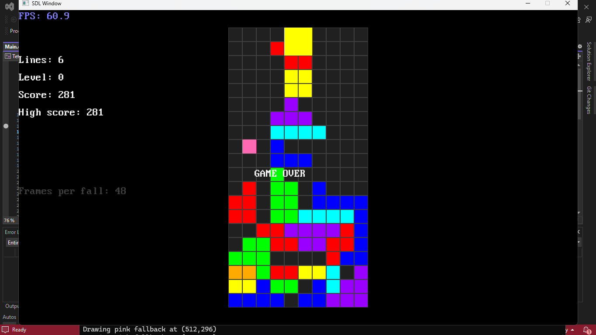

# 🎮 Tetris Game in C++


## 🧩 Overview
This is a classic Tetris game implemented entirely in C++. The project brings the timeless Tetris experience to the console, featuring smooth block movements, rotations, and line clearing. Players can track scores, aim for high scores, and progress through increasingly challenging levels. The game is fully functional and optimized for console execution, providing both a fun and educational experience.

The codebase demonstrates **object-oriented programming**, clean C++ practices, and modular design through separate classes and files for game logic, block movement, and Tetromino shapes. This makes it easy to read, maintain, and extend, making it ideal for learning, showcasing C++ skills, or adding new features.

---

## ⚡ Features
- ✅ Classic Tetris gameplay with block rotation and movement  
- ✅ Score tracking and high score system  
- ✅ Progressive levels for increasing difficulty  
- ✅ Smooth console-based gameplay  
- ✅ Intuitive keyboard controls: Arrow keys to move, Up Arrow to rotate, Q to quit  

---

## 🚀 How to Run
```bash
# Clone the repository
git clone https://github.com/mahithareddy01/TETRIS.git

# Navigate to the project folder
cd TETRIS

# Compile the code
g++ Main.cpp Game.cpp Movement.cpp Tetrominoes.cpp -o Tetris

# Run the game
./Tetris

```
---

## 🛠 Tech Stack
- **Language**: C++ (Standard Library)  
- **Platform**: Console-based application  
- **Design**: Object-Oriented Programming (OOP)  


## 📸 Screenshot

